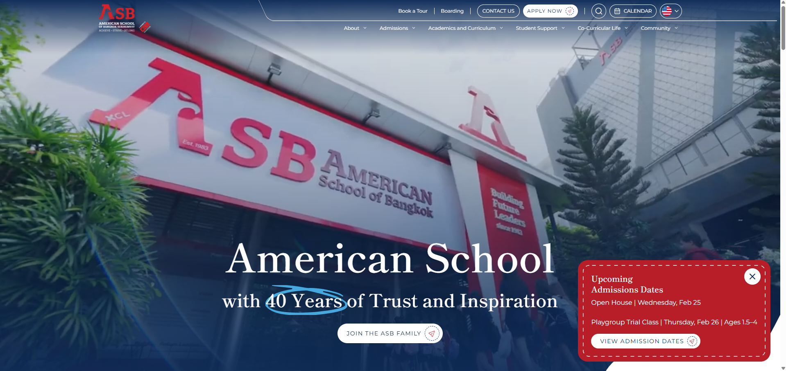
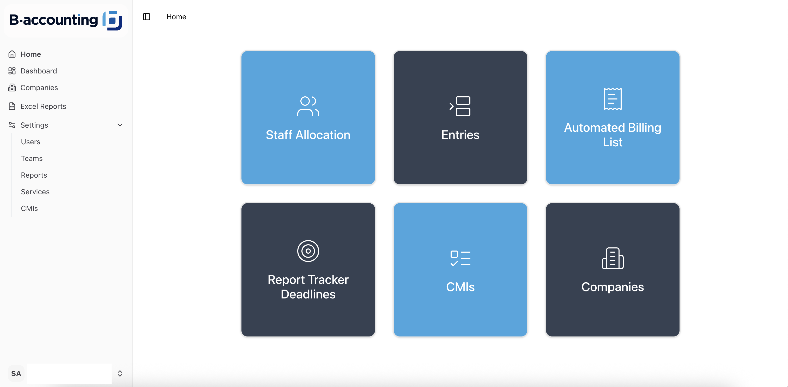
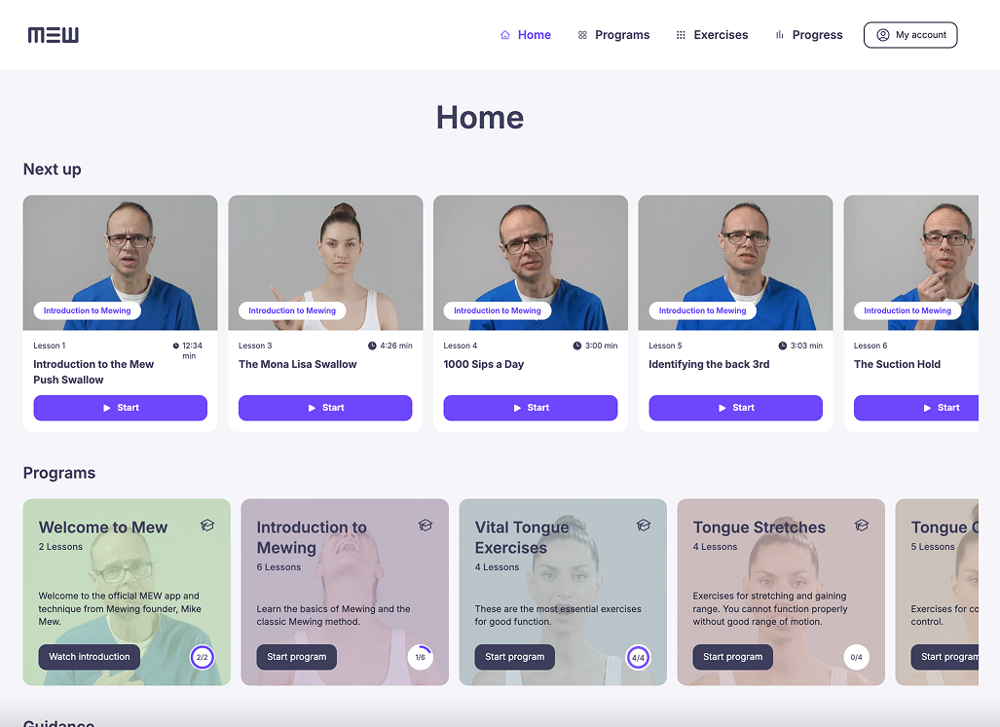
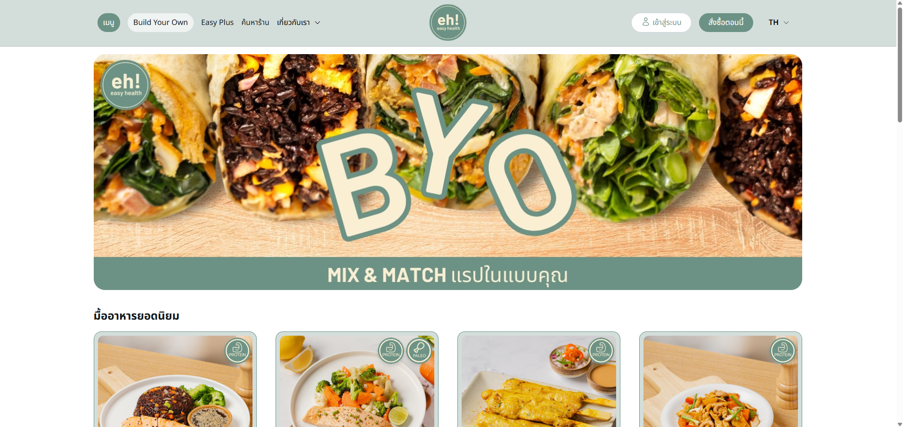
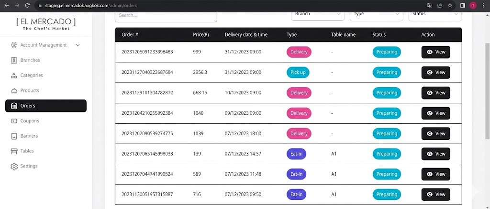
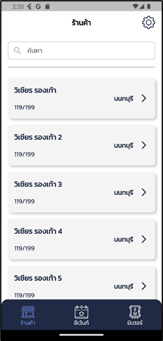
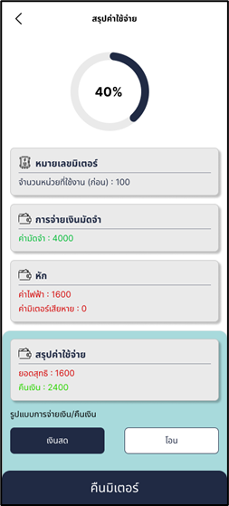
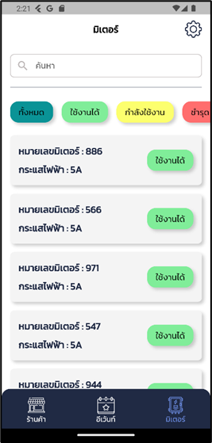
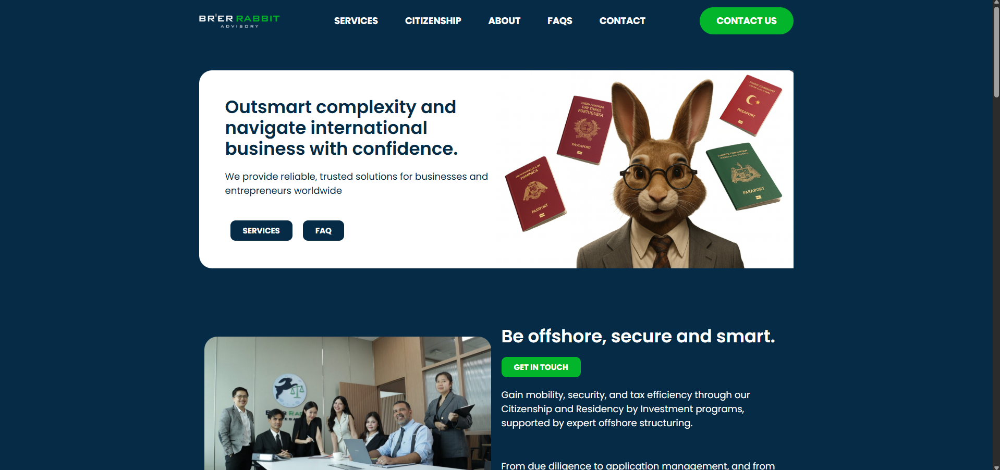

**Summary**

## Professional Experience Summary

Frontend Developer specializing in Next.js and modern web architecture, with hands-on experience delivering production-level applications across food delivery, education, analytics, fintech, and SaaS platforms.

Experienced in translating business requirements into scalable frontend systems, collaborating with backend teams, and integrating third-party services into seamless user experiences.

### Feature Development & System Enhancement

- Designed and implemented scalable **Coupon & Reward Systems**
- Built **Meal Plan Delivery Platform** with scheduling logic
- Developed structured **Admin Dashboard Interfaces** with data visualization
- Integrated third-party APIs and transformed complex backend data into user-friendly UI
- Developed dynamic **API-based filtering system** to convert coded datasets into configurable client-ready outputs

### Project Ownership & Leadership

- Led frontend development of a **School Website Project** (30%–100% project lifecycle ownership)
- Reviewed pull requests and maintained code quality across team members and external developers
- Delivered pixel-perfect frontend implementation from Figma designs
- Integrated WordPress (Elementor) content into Next.js architecture

### Financial & Service Systems

- Developed **One-shot Service System**
- Implemented receipt generation and transactional workflow logic

### WordPress Customization

- Customized WordPress themes and features based on client requirements
- Developed interactive world map with hover-based country highlighting and navigation

---

## Project

## ASB School

**March 13, 2025 – February 8, 2026**

**Description:**  
A school website project presenting tuition fees, curriculum details, faculty information, news updates, and admissions processes.

**Responsibilities:**

- Took over as Project Lead after ~30% project progress
- Reviewed interns’ pull requests and external client developers’ code before staging deployment
- Implemented frontend strictly following Figma design
- Integrated WordPress backend API with Next.js frontend
- Rendered Elementor pages inside Next.js
- Integrated JotForm into the system
- Fixed frontend issues based on client feedback
- Prepared technical documentation

**Technologies:**  
Next.js, WordPress, Tailwind, HeroUI, JotForm

---

## B Accounting

**October 22, 2025 – November 12, 2025**

**Description:**  
A system for overseeing company assets, tracking employee resources, managing client services, reports, and meetings.

**Responsibilities:**

- Developed frontend based on Figma design
- Implemented disbursement feature
- Implemented one-shot service feature

**Technologies:**  
Next.js, ShadCN UI, Next-Auth, Prisma, Tailwind

---

## N Infinite

**April 24, 2025 – September 17, 2025**

**Description:**  
A restaurant business analytics web application that tracks revenue, profit, total orders, and platform-based sales. Provides pie and bar charts for visualization and allows Excel export.

**Responsibilities:**

- Implemented frontend based on provided design
- Integrated third-party APIs and transformed data into user-friendly dashboards

**Technologies:**  
Next.js, Tailwind, HeroUI

---

## Mewing

**November 18, 2024 – March 19, 2025**

**Description:**  
A web and mobile application for teaching proper Mewing exercises with guided programs and instructional videos.

**Responsibilities:**

- Developed multiple frontend pages (Login, Programs, Exercises, Progress Tracking, etc.)
- Integrated company-provided APIs for video and content
- Improved frontend based on client feedback

**Technologies:**  
Next.js, Prisma, Tailwind, HeroUI

---

## Pipedrive

**October 10, 2024 – November 7, 2024**

**Description:**  
A real estate brokerage system for tracking property listings, commissions, sales performance, and agent revenue.

**Responsibilities:**

- Integrated and transformed raw API fields (e.g., cm_property: xxx)
- Simplified backend data structure for non-technical users

**Technologies:**  
Postman, TypeScript

_Backend-focused project — no public UI screenshots available._

---

## Easy Health

**July 9, 2024 – September 16, 2024**

**Description:**  
A clean-meal food ordering web application with meal plan delivery scheduling and branch-based order management.

**Responsibilities:**

- Developed reward coupon system
- Implemented branch-based ordering page with structured order table
- Built meal plan scheduling feature
- Developed branch settings configuration
- Created dashboards (Reward, Orders, Meal Plan)

**Technologies:**  
Next.js, Prisma, Tailwind, HeroUI

---

## El Mercado

**November 22, 2023 – December 12, 2023**

**Description:**  
A nationwide restaurant ordering web application with distance-based delivery pricing and local rider management.

**Responsibilities:**

- Implemented coupon management system with validation logic and condition configuration

**Technologies:**  
Next.js, Prisma, Tailwind, ShadCN UI

---

## Event Devices Meter Tracking

**July 3, 2023 – September 25, 2023**

**Description:**  
A system for tracking electricity meters for vendors at markets and large-scale event venues.

**Responsibilities:**

- Designed Web and Mobile applications using Figma
- Developed mobile app with Flutter
- Performed QA testing
- Prepared user manuals for both web and mobile platforms

**Technologies:**  
Flutter, Dart, Figma, Excel

  
  
  

---

## Brer Rabbit

**August 4, 2025 – August 6, 2025**

**Description:**  
A corporate website providing Citizenship by Investment and offshore solutions for globally mobile entrepreneurs and families.

**Responsibilities:**

- Implemented interactive world map with hover highlight and country-specific navigation

**Technologies:**  
WordPress

